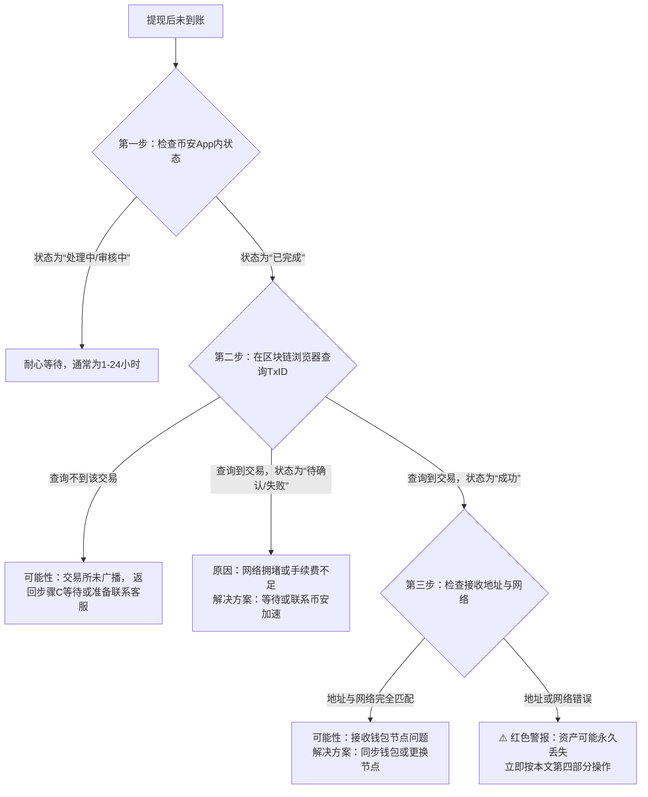

# 币安提现不到账紧急处理方案：保姆级教程，2026年最新实测避坑+20%折扣攻略！

你有没有经历过这样的时刻？在币安上点击“提现”后，眼睛死死盯着钱包余额，时间一分一秒过去，资产却迟迟没有到账。那种焦虑感，就像心脏被一只无形的手攥住，每一次刷新都伴随着失望。别慌，这几乎是每个币圈老鸟的必经之路。今天，我将用8年踩坑经验，为你彻底拆解“提现不到账”背后的所有可能性，并提供一套从自查到申诉的完整应急方案。更重要的是，无论你是新手还是老手，通过本文的专属链接注册，都能立刻锁定填写邀请码：BQ789，享受20%的终身手续费减免，让你的每一笔交易成本都降到最低。

---

## 一、 提现不到账？先别慌！99%的问题出在这三个环节

资产从交易所到你的个人钱包，看似一键操作，实则经历了“交易所审核 -> 区块链网络广播 -> 链上确认”三个核心环节。任何一个环节卡壳，都会导致延迟。

1.  **交易所审核环节（最常见）**：
    *   **风控审核**：这是2026年各大合规交易所的标配。对于大额、新地址、或频繁的提现操作，系统会自动触发人工或智能风控审核，时间从几分钟到24小时不等。
    *   **信息填写错误**：**这是导致资产永久丢失的头号杀手！** 提现地址填错、选错网络（例如将ERC20的USDT提到了TRC20地址），资产将无法找回。
    *   **余额或手续费不足**：忽略了提现手续费，或账户因挂单等原因存在“冻结资金”，导致可用余额不足。

2.  **区块链网络环节**：
    *   **网络拥堵**：在牛市或热门项目上线时，以太坊、比特币等网络可能异常拥堵，矿工费激增。如果你设置的手续费过低，交易可能一直处于“待打包”状态。
    *   **节点同步问题**：少数情况下，你使用的区块链浏览器或钱包节点同步延迟，导致无法查询到最新交易。👉 [点击立即注册 Binance | 锁定 20% 终身返佣（填写邀请码：BQ789）](https://binance.com/join?ref=BQ789) | 📱 [安卓极速版下载](https://download.maxweb.click/pack/BNApp_F0001001.apk)

3.  **到账确认环节**：
    *   **确认数不足**：不同的区块链和交易所对“到账”所需的网络确认数要求不同。比特币可能需要3-6个确认，以太坊可能需要12-30个确认。在达到要求前，钱包可能显示为“未确认”状态。

---

## 二、 保姆级自救排查流程图（2026实测版）

请严格按照以下步骤操作，切勿盲目联系客服：

**操作详解：**

**步骤一：登录币安App，找到提现记录。**
进入“钱包” -> “现货账户” -> “提现历史”。这里会清晰显示每一笔提现的**状态**（处理中、已完成、失败）和最重要的**TxID（交易哈希）**。

**步骤二：使用区块链浏览器查询。**
复制TxID，前往对应的区块链浏览器（如以太坊用Etherscan，比特币用Blockchain.com）粘贴查询。这是获取资金真实链上状态的唯一权威途径。

**步骤三：核对你提现时填写的“地址”和“网络”。**
与接收钱包的地址进行逐字比对。**风险提示1：务必理解“跨链”与“跨网络”的区别。将资产提到不支持的网络，找回希望渺茫。**

---

### 三、 2026 币圈全家桶：全网顶级福利矩阵
为了方便大家一次性配齐各大平台的最高优惠，建议收藏下方链接：

**1. 币安 Binance**
   * **官方注册链接：** [点击直达（省 20% 手续费）](https://binance.com/join?ref=BQ789)
   * **专属邀请码：** BQ789
   * **安卓 App 下载：** [官方极速下载通道](https://download.maxweb.click/pack/BNApp_F0001001.apk)

**2. OKX 欧易**
   * **官方注册链接：** [点击直达（最高省 20%）](https://okx.com/join/S123789)
   * **专属邀请码：** S123789
   * **安卓 App 下载：** [官方极速下载通道](https://download.fpnodexq.com/upgradeapp/android_G4567.apk)

**3. Bitget**
   * **官方注册链接：** [点击直达（最高省 20%）](https://partner.hdmune.cn/bg/m91x7fzz)
   * **专属邀请码：** FN1688

**4. GMGN (冲土狗必备链上平台)**
   * **官方注册链接：** [点击直达（解锁专业看板）](https://gmgn.ai/?ref=SC789)
   * **专属邀请码：** SC789

---

## 四、 终极解决方案：如何高效联系币安客服并申诉

如果以上自查均无法解决问题，请立即启动客服通道。2026年币安客服体系已全面升级，按此流程操作效率最高：

1.  **准备材料**：提前准备好以下截图——币安提现记录详情页（含TxID）、区块链浏览器查询结果页、你的账户注册邮箱/手机号。
2.  **进入官方客服通道**：在币安App内，点击右下角【我的】->【客服】图标（或聊天机器人）。输入“人工客服”多次，直至转接成功。👉 [点击立即注册 Binance | 锁定 20% 终身返佣（填写邀请码：BQ789）](https://binance.com/join?ref=BQ789) | 📱 [安卓极速版下载](https://download.maxweb.click/pack/BNApp_F0001001.apk)
3.  **清晰描述问题**：使用“时间+币种+金额+TxID+问题简述”的模板。例如：“2026年X月X日X时，提现1个BTC至地址XXX，TxID为XXX，区块链显示成功但钱包未收到，请协助核查。”
4.  **针对“填错地址”的紧急处理**：
    *   **情况A：提至其他交易所账户**：立即联系**接收方交易所**的客服，提供TxID，请求他们协助内部找回。这需要对方交易所的配合，成功率取决于其政策。
    *   **情况B：提至个人钱包错误网络**：如果该地址的私钥由你掌控（如MetaMask），可尝试导入对应网络查看。如果地址不属于你，**风险提示2：几乎无法找回，任何声称能帮你找回的个人或组织，99.999%是骗子。**

---

## 五、 2026年最新防坑指南与安全习惯

与其事后补救，不如事前预防。养成以下习惯，能避免99%的提现问题：

*   **小额测试原则**：向一个新地址提币，务必先进行一笔极小金额的测试，确认到账无误后再进行大额操作。
*   **“三重核对”法**：提现时，核对地址（首尾字符）、网络、Memo/Tag（如需）三遍。**风险提示3：Memo/Tag是某些链（如XRP, XLM, EOS）的必需标识，填错等同于丢币。**
*   **动态手续费设置**：在网络拥堵时，不要选择“普通”费率，适当提高为“快速”，以避免交易卡在内存池中数日。
*   **启用所有安全措施**：确保币安账户已开启**资金密码、2FA、防钓鱼码**。这不仅能防盗，也能在申诉时提升你的账户可信度。

---

## 总结

提现不到账是一场对耐心、细心和知识的考验。核心心法就是：**依靠链上数据（TxID+浏览器），而非个人感觉。** 保持冷静，按图索骥，从自查到客服，一步步排除问题。记住，在币圈，安全永远是第一位。而一个拥有BQ789邀请码福利的币安账户，不仅能让你在交易时节省真金白银，其背后代表的成熟平台体系，也是你资产安全的第一道坚实防线。