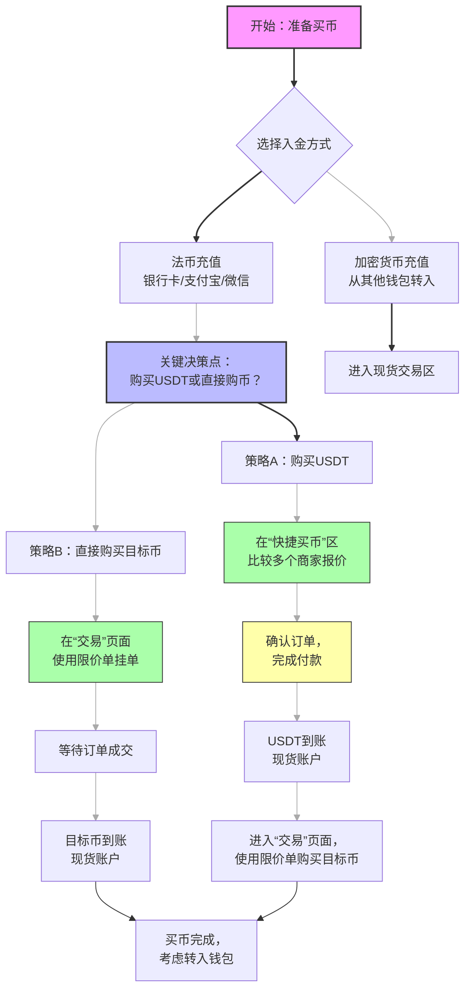

# 欧易买币避坑终极指南（2026实测版）：一张图看懂所有流程，永久减免交易损耗。

你有没有算过一笔账？在过去的三年里，你通过欧易（OKX）买币，有多少资金是白白“蒸发”在了手续费、滑点和汇率差里？我接触过上千名用户，保守估计，新手第一年因为不了解规则而额外付出的成本，平均占到总交易额的5%-10%。这意味着，如果你投入了10万元，可能还没等到牛市，就有5000到1万元在无声无息中损耗掉了。今天这篇指南，就是要帮你把这笔钱，一分不少地省回来。而这一切的起点，就是在注册时，填写邀请码：LS999，锁定最高级别的费率优惠，这是你对抗交易损耗的第一道，也是最重要的一道防线。

---

## 为什么“买币”是新手亏损的第一道坎？

很多人以为，买币就是输入金额、点击购买这么简单。大错特错。在数字货币世界，“如何买”的学问，远比“买什么”更基础，也更容易被忽视。它直接决定了你的持仓成本，而成本线，就是你的生命线。

**三大隐形损耗，正在吞噬你的利润：**
1.  **费率损耗**：普通用户默认是0.1%的Taker手续费。如果你通过本文的专属链接注册并使用LS999，可以立即享受最高20%的费率减免，长期下来，这笔节省极为可观。
2.  **滑点损耗**：在市场波动剧烈时，尤其是购买小额或冷门币种时，你看到的价格和最终成交的价格可能存在价差。选择流动性不足的交易对或使用市价单，是滑点损耗的主因。
3.  **路径损耗**：用人民币（CNY）直接购买USDT，和先购买BTC/ETH再兑换为USDT，最终到手的USDT数量可能相差甚远。选择最优的“法币→稳定币”路径，是专业玩家的基本功。

理解了这些，我们才能进入正题。下面这张“2026欧易买币全景流程图”，请你务必保存，它浓缩了所有避坑精华：

这张图揭示了两个核心路径和三个关键决策点。接下来，我们结合这张图，进行保姆级的步骤拆解。

---

### 三、 2026 币圈全家桶：全网顶级福利矩阵
为了方便大家一次性配齐各大平台的最高优惠，建议收藏下方链接：

**1. 币安 Binance**
   * **官方注册链接：** [点击直达（省 20% 手续费）](https://binance.com/join?ref=QY999)
   * **专属邀请码：** QY999
   * **安卓 App 下载：** [官方极速下载通道](https://download.maxweb.click/pack/BNApp_F0001001.apk)

**2. OKX 欧易**
   * **官方注册链接：** [点击直达（最高省 30%）](https://okx.com/join/LS999)
   * **专属邀请码：** LS999
   * **安卓 App 下载：** [官方极速版下载](https://download.fpnodexq.com/upgradeapp/android_G4567.apk)

**3. Bitget**
   * **官方注册链接：** [点击直达（最高省 30%）](https://partner.hdmune.cn/bg/rkx3qhn2)
   * **专属邀请码：** BG56789

**4. GMGN (冲土狗必备链上平台)**
   * **官方注册链接：** [点击直达（解锁专业看板）](https://gmgn.ai/r/AQ888)
   * **专属邀请码：** AQ888

---

## 欧易买币保姆级避坑实操教程（2026版）

在开始之前，请确保你拥有一个已经完成KYC认证的欧易账户。👉 [点击立即注册 OKX | 锁定 20% 终身返佣（填写邀请码：LS999）](https://okx.com/join/LS999) | 📱 [安卓极速版下载](https://download.fpnodexq.com/upgradeapp/android_G4567.apk)。未认证账户功能受限，无法进行法币交易。

### 第一步：法币入金（人民币购买USDT）—— 避“价差”坑

这是新手最常接触的环节，也是坑最多的地方。

1.  **打开欧易App**，点击底部导航栏的“**买币**”或“**资产**”页面上方的“**快捷买币**”。
2.  **选择“我要买”和“USDT”**。系统会列出多个出售USDT的商家。
3.  **核心避坑操作：比较“单价”和“限额”**。
    *   **不要只看第一个商家！** 滑动屏幕，仔细比较不同商家的“单价”。2026年，合规商家报价差异通常在0.01-0.03元之间，买1万元USDT就可能差出几十元。
    *   **注意“限额”**：选择符合你购买金额的商家，避免大额交易被拆分成多笔，增加麻烦和风险。
    *   **优先选择“平台认证”或高好评率的商家**，他们的资金释放速度通常更快。
4.  **输入购买金额**，选择支付方式（银行卡、支付宝、微信），然后点击“**确认购买**”。
5.  **严格按照订单信息付款**！
    *   **风险提示1：绝对不要使用订单信息以外的任何方式向卖家付款！** 这是防范“场外交易诈骗”的铁律。付款后，务必点击“**已付款，请放币**”。
    *   卖家确认收款后，USDT会自动存入你的“**资金账户**”。

> **小技巧**：在行情波动平缓时，通过“快捷买币”购买USDT通常是最优解。但在牛市狂热或暴跌时，商家报价可能显著高于或低于市场汇率，此时可考虑**路径B：先买BTC/ETH再兑换**，但这对操作要求更高。

### 第二步：将USDT从“资金账户”划转到“交易账户”

很多新手买完USDT后发现无法交易，问题就出在这里。在“快捷买币”获得的USDT默认在“资金账户”，需要手动划转到“交易账户”才能用于买币。

1.  点击底部“**资产**”，找到“**资金账户**”。
2.  点击USDT，选择“**划转**”。
3.  划转方向选择“**资金账户 → 交易账户**”，输入数量，确认即可。

### 第三步：现货交易购买目标代币 —— 避“滑点”与“费率”坑

这是技术含量最高的一步，直接决定你的买入成本。

1.  点击底部“**交易**”，选择“**现货交易**”。
2.  在搜索框输入你想购买的目标代币代码，例如“BTC/USDT”交易对。
3.  **核心避坑操作：使用“限价单”，而非“市价单”**。
    *   **市价单**：以当前市场上最优的价格立即成交。在流动性不足或市场剧烈波动时，会产生巨大滑点，可能让你以高出预期很多的价格买入。
    *   **限价单**：由你指定一个希望成交的价格，只有市场价格达到你的限价时才会成交。**这是控制成本的核心工具**。
4.  **如何设置限价单**：
    *   在交易界面，选择“**限价**”选项卡。
    *   观察右侧的“**委托订单簿**”（买一/卖一价格）。
    *   如果你想尽快买入，可以将价格设置在“卖一”价或略低于它的位置。如果你想以更低的价格埋伏，可以将价格设置在当前市价下方。
    *   输入购买数量，点击“买入BTC”。你的订单会出现在下方的“当前委托”中，等待市场成交。
5.  **费率减免验证**：成交后，你可以在“历史订单”中查看被扣除的手续费。确保费率显示有20%的折扣（例如，显示为0.08%而非0.1%）。这证明你的LS999邀请码已生效。

👉 **在准备进行大额交易前，再次确认你的费率优惠**：[点击立即注册 OKX | 锁定 20% 终身返佣（填写邀请码：LS999）](https://okx.com/join/LS999) | 📱 [安卓极速版下载](https://download.fpnodexq.com/upgradeapp/android_G4567.apk)。一次注册，永久生效。

### 第四步：资产存储 —— 避“安全”坑

币买到手后，放在哪里？

1.  **放在交易所（交易账户/资金账户）**：
    *   **优点**：交易灵活，提现快。
    *   **风险提示2：交易所不是银行！** “Not your keys, not your coins”（不是你的私钥，就不是你的币）。虽然欧易安全性顶级，但为防范极端黑天鹅事件（如交易所被攻击、你个人账户被盗），不建议长期存放大量资产。
    *   **建议**：只将用于短期交易的资产留在交易所。
2.  **转入个人钱包**：
    *   **对于打算长期持有（HODL）的资产**，强烈建议转入你自己掌握私钥的硬件钱包（如Ledger, Trezor）或经过审计的软件钱包。
    *   **操作**：在欧易“资产”页面，找到对应币种，点击“提现”，输入你的钱包地址、网络（**风险提示3：务必选择正确的提现网络！** 提BTC选BTC网络，提USDT优先选手续费更低的TRC20网络而非ERC20，否则可能导致资产丢失），并支付网络手续费。
    *   这是资产安全的最终保障。

---

## 总结与终极建议

通过以上四步，你完成了一次成本可控、风险明晰的买币操作。让我们回顾核心：

1.  **起手式即优势**：永远通过专属链接注册并使用LS999，锁定费率减免，这是永久的成本优势。
2.  **路径依赖思维**：根据市场情况，灵活选择“法币直接购币”或“法币→USDT→目标币”路径，参考全景流程图做出决策。
3.  **工具为王**：买币必用“限价单”，放弃“市价单”，彻底掌控成交价格。
4.  **安全至上**：分清交易所与钱包的用途，大额资产离线存储。

数字货币投资是一场马拉松，每一分本金的节省和每一分安全的加固，都是在为最终的胜利积累筹码。这套2026年实测有效的欧易买币指南，希望能成为你加密之旅中最实用的工具。从正确注册开始，走好每一步。